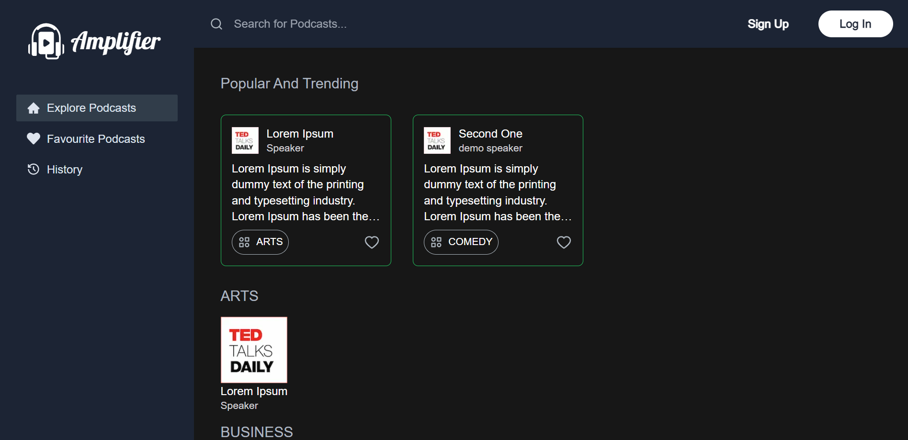

# Amplifier

Amplify your Podcast Experience



Here users can listen to both audio and video podcasts !

## Steps to Build and Run:

\*\* Docker, NodeJS must be installed in your system.

Step 1: Clone the github repo

```
git clone https://github.com/pinakipb2/Amplifier.git
```

Step 2: Create .env file and copy the contents from .example.env and generate your own tokens and update in .env file.

Step 3: Run docker using

```
docker compose up
```

This will start mysql service.

Step 4: Run the commands:

```
cd client
```

```
npm i
```

This commands will generate DB schemas and will seed the default admin.

```
npx prisma migrate dev
```

```
npm prisma db seed
```

```
npm run dev
```

Step 4: Site is live @ http://localhost:3000

For Admin to login, go to : http://localhost:3000/admin/login
Email: admin@amplifier.com
Password: 12345678

## Documentation:

Documentation can be accessed here: [Amplifier Documentation](https://docs.google.com/document/d/17F463Jb7BpxDHEJGSvDW35M8NP_odAzQRL0bpHcK0M4/)
